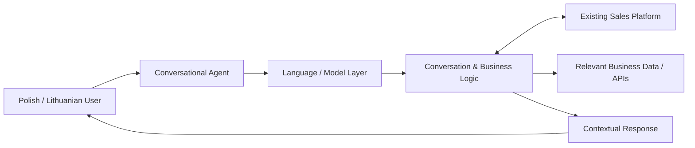

# Polish / Lithuanian Conversational AI Agent

**Paid client engagement · Multilingual conversational software · 2024–2025**

[← Back to case studies](../README.md)

## Overview

This engagement centered on a conversational AI agent for client interactions in **Lithuanian and Polish**, designed to integrate with an existing sales platform.

The project combined multilingual AI evaluation with the practical software-engineering concerns required to connect a conversational component to an existing business workflow.

---

## System Scope

This is a sanitized representation of the documented system boundary, not the client's private production topology.

---

## Primary Requirements

The retained project material identifies several core requirements:

- fluent interaction in Lithuanian and Polish
- support for client/customer-facing conversations
- compatibility with an existing sales platform
- API-based integration
- testing against realistic interactions in both languages
- production deployment and ongoing monitoring considerations

Potential use cases discussed during discovery included customer inquiries, sales guidance and product recommendations.

---

## Multilingual Model Evaluation

A meaningful part of the early engineering work was determining whether the target languages had sufficiently capable model resources.

The retained research evaluated language-specific resources including:

- a Lithuanian LLM released by Neurotechnology and based on LlamaV2
- Poland's PLLuM ecosystem
- additional Polish-language model / speech resources

These were evaluated as possible technical resources for achieving appropriate language fluency.

**Important:** their presence in project research does not by itself prove that those exact models became the final production inference stack. This public case study therefore treats them as evaluated resources rather than claiming an unverified deployment architecture.

---

## Integration Problem

A useful conversational system for this engagement could not exist as a standalone chatbot. It needed to operate within an existing sales environment.

The documented engineering path included:

1. define the business interactions the agent should handle
2. determine language/fluency requirements
3. select or evaluate suitable AI resources
4. connect the conversational layer to the existing platform through APIs
5. test Polish and Lithuanian interactions
6. evaluate reliability and response quality
7. deploy and monitor the integrated system

This shifts the problem from simply "calling an LLM" to managing the boundary between probabilistic language behavior and deterministic business systems.

---

## Engineering Concerns

### Language quality

Fluency had to be evaluated independently for two languages with different available model ecosystems. Business terminology and conversational quality matter more than nominal language support.

### Existing-platform integration

The agent needed an API boundary to the client's sales platform. That requires clear separation between conversational reasoning and operations performed against business systems.

### Conversation testing

Testing needed to cover realistic interactions in both target languages rather than only API-level success responses.

### Extensibility

Discovery also considered features such as voice capability, multilingual switching and interaction analytics, making it important to avoid an architecture tightly coupled to one narrow conversation path.

### Production operation

Deployment, scalability, monitoring and feedback-driven improvement were included in the documented project approach.

---

## Technology Disclosure

The retained documentation supports the multilingual requirements, API-integration architecture, model-resource evaluation, testing strategy and deployment considerations.

It does **not** provide enough implementation evidence to state with confidence which researched language model, cloud provider or supporting service represented the final production configuration.

Those details are therefore intentionally not fabricated here.

---

## Confidentiality

Client identity, sales-platform internals, private datasets, customer conversations, credentials and proprietary integration details are excluded from this public repository.
