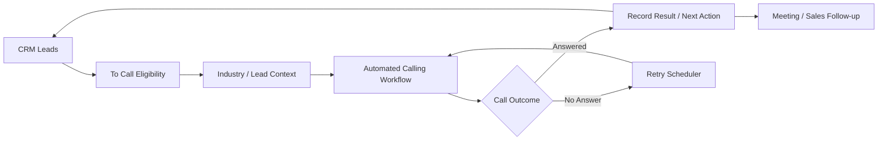

# Polish AI Cold-Calling & Lead Automation

**Paid client engagement · Outbound sales automation · 2024–2025**

[← Back to case studies](../README.md)

## Overview

This engagement focused on automating an outbound sales process for a **Polish-speaking market** around CRM-managed leads, personalized call scripts, repeat-attempt handling and downstream sales actions.

The retained requirements material shows that the system had to operate as part of an existing sales process rather than as an isolated voice demo.

---

## Core Workflow

The public diagram abstracts away the client's private CRM schema, scripts and calling configuration.

---

## Requirements Addressed

### CRM-driven execution

The calling workflow was designed around leads already managed in a CRM. A lead's state determined whether it entered the outbound calling process, including a documented **"To Call"** status concept.

This required the automation to treat CRM state as operational input rather than maintaining a disconnected calling list.

### Script personalization

The requirements called for **industry-specific scripts** and access to industry context stored with lead/CRM data.

That creates a separation between:

- lead identity and CRM state
- industry / contextual information
- script selection or personalization
- call execution
- resulting CRM updates

### Polish-language operation

Polish was the initial target language, with future geographic/language expansion explicitly considered during requirements gathering.

The engineering scope therefore had to account for language quality as part of the calling experience rather than treating text or speech as language-neutral.

### Retry orchestration

A significant workflow requirement was handling unanswered calls. The retained specification explicitly references **up to six call attempts** and asks how those attempts should be scheduled across time intervals/days.

That turns a single call action into a stateful automation problem involving attempt count, timing and terminal outcomes.

### Lead volume and scalability

Lead throughput was an explicit design question. The workflow needed to consider daily/weekly lead volume and future expansion rather than assuming one-off manual execution.

### Reporting and maintenance

The discovery material also identifies activity reporting, analytics and post-development maintenance as explicit operational concerns.

---

## Engineering Concerns

The project required reasoning about several boundaries that commonly make outbound automation difficult:

- CRM API integration
- lead-state transitions
- idempotent processing / duplicate-call avoidance
- attempt counters and retry scheduling
- contextual script selection
- language-specific interaction quality
- call-result persistence
- meeting/follow-up handoff
- reporting and observability
- future scaling to additional markets

---

## Technology Disclosure

The retained material establishes the CRM/API, calling, automation and Polish-language requirements, but it does **not provide enough reliable evidence to publish every final production vendor or model choice**.

For that reason, this case study intentionally does not claim a specific voice-AI provider, model or final CRM product unless it can be verified from retained implementation evidence.

That distinction is deliberate: a commercial case study should describe what was engineered without converting discovery-stage possibilities into fictional production architecture.

---

## Confidentiality

The client's CRM, lead lists, phone numbers, scripts, calling credentials, recordings and business analytics remain private. No production customer or prospect data is published in this repository.
