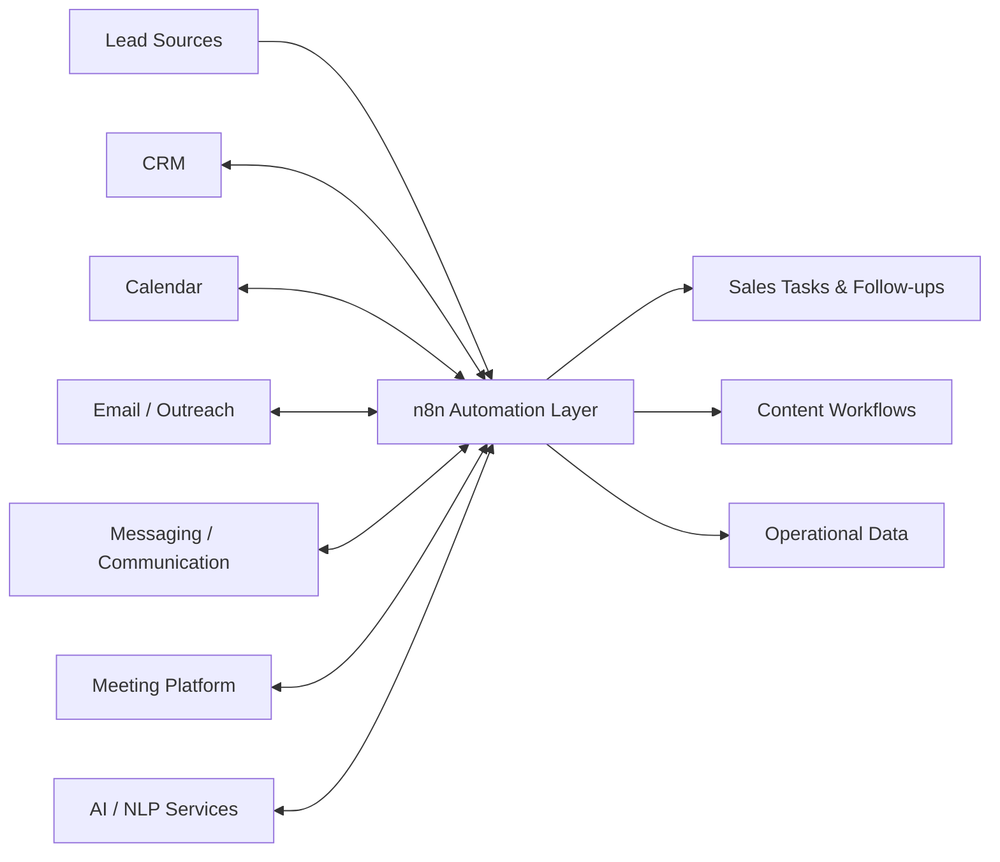

# Seven-System Sales & CRM Automation Suite

**Paid client engagement · Sales and marketing automation · 2025**

[← Back to case studies](../README.md)

## Overview

This engagement covered a coordinated set of **seven automation systems** for sales and marketing operations. The retained project documentation organizes the work into three delivery phases and identifies n8n as the central workflow-orchestration platform, supplemented by custom JavaScript and external APIs.

The seven documented systems were:

1. Calendar and CRM Automation
2. Sales Process Automations
3. Virtual Sales Room
4. Lead Management and Outreach Automation
5. Sales Meeting and Post-Meeting Automation
6. Content Automation Tools
7. Bonus Tools

The engineering challenge was broader than automating a single repetitive task: multiple business workflows had to exchange data across CRM, scheduling, communication, meeting and content systems while preserving understandable operational flows.

---

## System Map

This diagram represents the documented architectural pattern rather than exposing the client's private production topology.

---

## 1. Calendar & CRM Automation

The documented objective was to reduce manual scheduling and CRM administration through workflows such as:

- contact creation and updates
- meeting scheduling
- calendar/CRM synchronization
- follow-up reminders
- post-meeting status updates
- scheduling-rule handling such as conflicting availability

The project material identifies Google Calendar and HubSpot as integration targets and OAuth-secured API access as part of the design.

---

## 2. Sales Process Automations

This system addressed opportunity detection and lead nurturing.

The documented workflow design included:

- ingesting CRM and engagement signals
- aggregating lead activity
- evaluating lead intent / potential
- applying scoring logic
- triggering follow-up email or CRM tasks
- allowing scoring thresholds and nurturing rules to evolve

Custom JavaScript inside workflow logic was part of the planned engineering approach.

---

## 3. Virtual Sales Room

The Virtual Sales Room was designed around AI-assisted customer interaction and sales operations.

Documented capabilities included:

- chat / communication workflow handling
- lead qualification
- conversational intent handling
- meeting-data processing
- CRM logging
- meeting-summary workflows
- scheduling-related intents

The retained architecture references communication and meeting APIs together with CRM updates through the automation layer.

---

## 4. Lead Management & Outreach

This component focused on turning incoming lead data into structured sales action.

The documented scope included:

- lead collection
- filtering and scoring
- CRM synchronization
- personalized outreach generation
- email delivery workflows
- sales-representative review/approval concepts
- monitoring of delivery and automation behavior

---

## 5. Sales Meeting & Post-Meeting Automation

Meeting workflows were designed to reduce the administrative work surrounding sales calls.

Documented areas included:

- meeting metadata capture
- speech-to-text processing
- meeting summarization
- pre-meeting preparation workflows
- post-meeting follow-ups
- CRM logging
- coaching / analysis concepts
- integration-error monitoring

AssemblyAI, Zoom, HubSpot and NLP tooling appear in the retained project design material.

---

## 6. Content Automation Tools

The content workstream targeted AI-assisted creation and publishing workflows for channels such as LinkedIn and YouTube.

The retained scope covers:

- prompt/input collection
- generation of content drafts or scripts
- review workflows
- publishing integrations
- analytics/API interaction
- monitoring of posting success

---

## 7. Supporting / Bonus Tools

The seventh workstream grouped supporting sales utilities. Documented concepts included:

- lightweight CRM functionality
- automated product demos / bot interactions
- product-to-buyer matching logic
- structured customer-data storage
- webhook-driven automation

---

## Documented Technology Landscape

The retained project plan references the following technology categories and services:

| Area | Documented technology / target |
| --- | --- |
| Workflow orchestration | n8n |
| Custom workflow logic | JavaScript |
| CRM | HubSpot |
| Scheduling | Google Calendar |
| Email | SendGrid |
| Meetings | Zoom |
| Messaging | Twilio / WhatsApp concepts |
| Speech processing | AssemblyAI |
| NLP / AI | Google Cloud Natural Language |
| API validation | Postman |
| Hosting | DigitalOcean |
| Supporting data | Airtable / custom database concepts |
| Version control | GitHub |

These entries describe the retained project architecture and integration plan. They should not be interpreted as a claim that every proposed service remained unchanged in the final production implementation.

---

## Engineering Approach

The engagement documentation describes an iterative delivery process:

**requirements → workflow architecture → implementation → API/integration testing → deployment → monitoring → documentation/handover**

Particular engineering concerns included:

- coordinating state across multiple SaaS platforms
- API authentication and external-system boundaries
- avoiding duplicate or conflicting scheduling actions
- preserving CRM consistency
- failure/error notifications
- making automation rules maintainable after handover
- validating integrations independently as well as end-to-end

---

## Confidentiality

The actual client workflows, credentials, sales data and proprietary automation exports are private. This case study therefore documents system boundaries and engineering scope rather than publishing production workflow JSON or client data.
